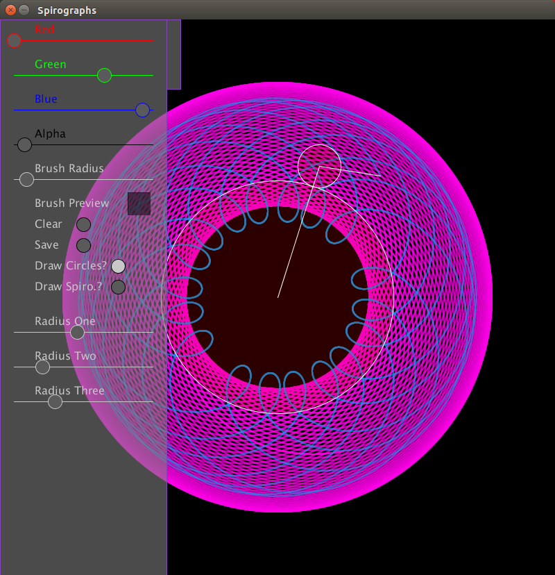
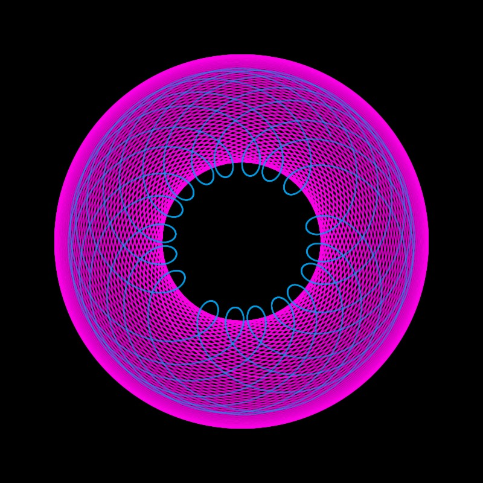

processing-spirograph
=====================

A processing sketch that allows the user to play with a spirograph. 

<h3> What? </h3>
I was thinking of the spirograph toy that many people have encountered. For a refresher see: http://en.wikipedia.org/wiki/Spirograph While there are many ways to generalize this mathematically, for example some kind roullete curve graphing utility, I was mostly focused on recreating the expereince and results of playing with a spirograph.

Here is a screen shot of the sketch in action:

Here is the output created by save button on the above screenshot:

<h3> How </h3>
As above this is a processing sketch, so you will need a distribution of processing. 
In general I would suggest downloading the processing IDE from here: https://processing.org/download/ 
Alternativley, it is easy to use the processing-java utility to build and run the sketches from your environment of choice. I am a fan of https://github.com/sophacles/vim-processing 

<h3> Why? </h3>
This sketch was a project I made (mostly) over the summer of 2014. I brushed it off recently to post on github. I followed though with it mostly to develop some GUI components for processing sketches. It was an interesting forray into object oriented design for me. I learned some lessons that made their way into the code as I used it on other things. However, I like this project as a snapshot of my progress in things so I will keep it in its "original" condition. 

<h3> References </h3>
The interface design was inspired by / based on the work of jared counts. In particular, his flock sketch featured a very flashy GUI setup that I found to be extremely practical for interactive processing sketches. Jared Count's website can be found here:
http://jaredcounts.com/

